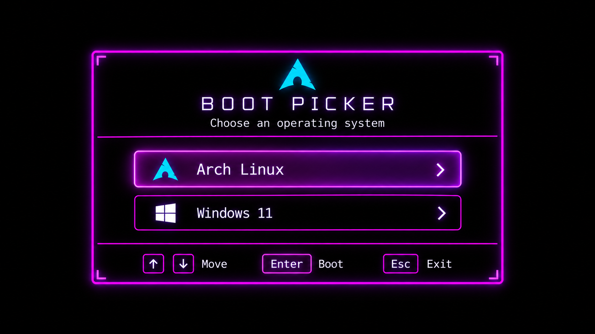
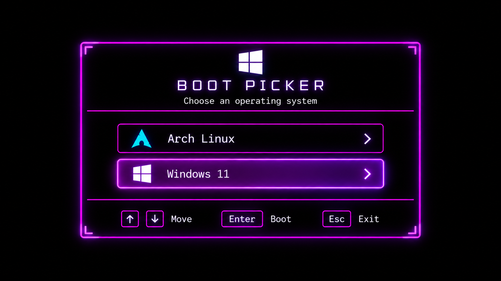

# bootpicker

this project is a custom graphical **UEFI boot picker** for dual-booting **Arch Linux and Windows 11**, built in C++ with EDK II.

bootpicker runs before either operating system starts and provides a simple keyboard controlled graphical menu for choosing which OS to boot.





## features

- native UEFI application
- graphical interface using UEFI GOP
- 2560×1440 boot screen artwork
- Arch Linux and Windows 11 support
- keyboard navigation
- automatically prefers a 2560×1440 GOP mode
- falls back to the highest available GOP resolution
- directly chainloads the selected EFI bootloader
- no GRUB required
- can be safely tested from a USB drive before installation

## controls

| Key | Action |
| --- | --- |
| `↑` | Select Arch Linux |
| `↓` | Select Windows 11 |
| `Enter` | Boot selected operating system |
| `Esc` | Exit BootPicker |

## default boot paths

bootpicker currently expects:

### Arch Linux

```text
\EFI\Linux\arch-linux.efi
```

### Windows 11

```text
\EFI\Microsoft\Boot\bootmgfw.efi
```

these paths can be changed near the top of:

```text
BootPicker/BootPickerFinal.cpp
```

## project structure

```text
bootpicker-cimoh/
│
├── BootPickerFinalPkg.dsc
│
├── BootPicker/
│   ├── BootPickerFinal.cpp
│   ├── BootPickerFinal.inf
│   │
│   └── Assets/
│       ├── ArchSelected.bmp
│       ├── WindowsSelected.bmp
│       ├── ArchSelectedFinal.png
│       └── WindowsSelectedFinal.png
│
├── README.md
└── LICENSE
```

the PNG files are the source/display versions of the artwork.

the BMP files are the versions loaded directly by bootpicker while running in UEFI.

## requirements

to build bootpicker on Windows:

- Windows 11
- EDK II
- visual studio build tools
- NASM
- python
- git

the current project was built using the `VS2026` EDK II toolchain.

## building

clone EDK II first:

```cmd
git clone https://github.com/tianocore/edk2.git
cd edk2
```

initialize the EDK II submodules if required:

```cmd
git submodule update --init
```

clone bootpicker directly into the EDK II workspace as `BootPickerPkg`:

```cmd
git clone https://github.com/cimohhh/bootpicker-cimoh.git BootPickerPkg
```

open a visual studio developer command prompt and go to the EDK II directory:

```cmd
cd /d C:\path\to\edk2
```

make sure NASM is available in `PATH`, then initialize EDK II:

```cmd
edksetup.bat
```

build bootpicker:

```cmd
build -a X64 -t VS2026 -b DEBUG -p BootPickerPkg\BootPickerFinalPkg.dsc
```

after a successful build, the EFI executable should be located at:

```text
Build\BootPickerFinal\DEBUG_VS2026\X64\BootPicker.efi
```

## assets

bootpicker uses two 24-bit BMP files:

```text
ArchSelected.bmp
WindowsSelected.bmp
```

the final artwork is designed for:

```text
2560 × 1440
RGB
24-bit BMP
```

bootpicker searches several locations for its images, including:

```text
\EFI\BootPicker\Assets\
\EFI\BOOT\Assets\
\Assets\
```

for a normal permanent installation, the recommended layout is:

```text
EFI\
└── BootPicker\
    ├── BootPicker.efi
    └── Assets\
        ├── ArchSelected.bmp
        └── WindowsSelected.bmp
```

## testing from USB

testing from USB is something i really recommend before installing bootpicker to your internal EFI system partition.

format a USB drive as a UEFI readable filesystem such as FAT32.

create:

```text
EFI\
├── BOOT\
│   └── BOOTX64.EFI
│
└── BootPicker\
    └── Assets\
        ├── ArchSelected.bmp
        └── WindowsSelected.bmp
```

copy the compiled bootpicker EFI executable to:

```text
EFI\BOOT\BOOTX64.EFI
```

then copy both BMP files to:

```text
EFI\BootPicker\Assets\
```

reboot the computer and select the USB's **UEFI** entry from the motherboard boot menu.

this allows bootpicker to be tested without replacing the existing internal boot configuration.

## permanent installation

> **Warning** (i'm serious)
>
> be careful when modifying the EFI System Partition. do not delete or overwrite your Windows or Linux bootloader files.

a typical internal EFI layout may look like:

```text
EFI\
├── BootPicker\
│   ├── BootPicker.efi
│   └── Assets\
│       ├── ArchSelected.bmp
│       └── WindowsSelected.bmp
│
├── Linux\
│   └── arch-linux.efi
│
├── Microsoft\
│   └── Boot\
│       └── bootmgfw.efi
│
└── systemd\
```

bootpicker should be installed separately from the operating system bootloaders.

do **not** overwrite:

```text
EFI\Microsoft\
EFI\Linux\
EFI\systemd\
```

once installed, create a UEFI firmware boot entry pointing to:

```text
\EFI\BootPicker\BootPicker.efi
```

## how it works

bootpicker uses the UEFI graphics output protocol to display the graphical menu.

at startup it:

1. locates the UEFI graphics output protocol.
2. searches for a 2560×1440 graphics mode.
3. falls back to the available mode with the highest pixel count if 2560×1440 is unavailable.
4. loads the selected state BMP from an EFI filesystem.
5. displays the artwork directly through GOP.
6. waits for keyboard input.
7. loads and starts the selected operating system's EFI executable.

the graphical interface itself is stored as pre rendered images, allowing smoother text, logos, borders, and effects than firmware fonts would normally provide.

## secure boot

bootpicker is currently an unsigned custom EFI application.

systems with secure boot enabled may refuse to launch it unless the EFI binary is signed with a trusted key.

if bootpicker does not launch, check the system's secure boot configuration.

## current targets

the default configuration is designed for:

- Arch Linux
- Windows 11
- x86-64 UEFI systems

other Linux distributions can be used by changing the Linux EFI path in the source code.

## disclaimer

modifying EFI partitions and firmware boot entries can make an operating system temporarily unbootable if done incorrectly.

always keep a known good boot method available and test bootpicker from USB before making it the default firmware boot entry.

## License

see [LICENSE](LICENSE).
